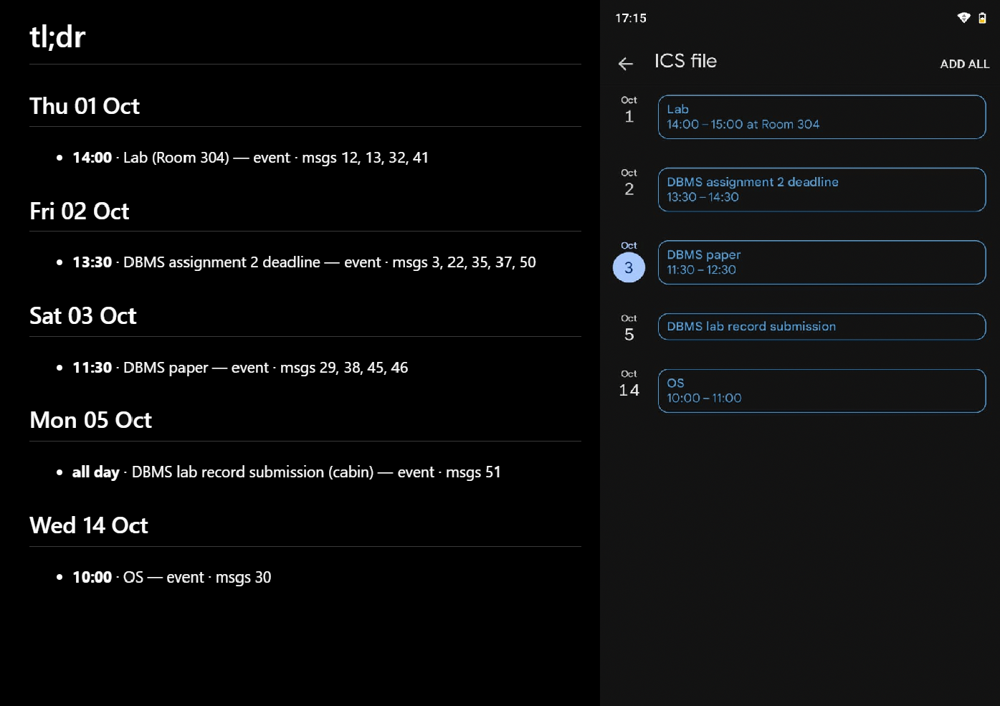

# tl;dr

**A local LLM that reads your college group chat so you don't have to.**

Group chats bury the one real deadline under hundreds of messages, memes and
"bhai sab aa gaye?". tl;dr reads a WhatsApp export, extracts only the
deadlines, events and changes of plan, and gives you a clean summary plus a
calendar file you can import.

It runs **entirely on your machine** (Ollama + an open model(gemma4:e4b was used during development)). The chats it was built for are group chats of friends, so nothing is ever sent to a cloud API.
It handles **Hinglish (Hindi words written in English)**: "kal 5 baje", "parso", "ab Friday tak hai".

Built for the DEV Hacktoberfest 2026 Weekend Challenge, *Build for a Friend*.



## Example

Input (abridged, from `data/sample_chat.txt`):

```
[3]  Aditi: guys DBMS assignment 2 ka deadline Thursday hai, 1 Oct
[22] Aditi: Update: assignment deadline postpone ho gaya, ab Friday 2 Oct tak hai
[35] Aditi: kal 2 baje tak submit karna hai
[50] Aditi: portal pe 1:30 tak
```

Output (`out/tldr.md`):

```markdown
## Fri 02 Oct
- 13:30 · DBMS assignment 2 deadline — due · msgs 3, 22, 35, 37, 50
```

One card with its history and the messages it came from, instead of four
contradictory deadlines. `out/tldr.ics` has the same events for your calendar.

## Quickstart

Requires Python 3.10+ and [Ollama](https://ollama.com) (a recent version).

```bash
git clone https://github.com/karansingh-in/TL-DR.git
cd TL-DR
python -m venv .venv
# Windows: .venv\Scripts\activate      macOS/Linux: source .venv/bin/activate
pip install -r requirements.txt
ollama pull gemma4:e4b

python -m src.cli data/sample_chat.txt --verbose
```

Writes `out/tldr.md`, `out/tldr.ics` and `out/state.json`.

To use your own chat: in WhatsApp, open the chat, **Export chat -> Without
media**, put the `.txt` in `data/`, and point the CLI at it.

## How it works

```
chat.txt -> parse -> windows -> LLM extraction -> reconcile -> resolve dates -> render
```

- **Windows by time gap.** The chat is split where the conversation pauses, with
  overlap between windows so a plan that changes at a boundary isn't lost.
- **Stateful extraction.** Each window sees the items found so far (tagged `K1`,
  `K2`, ...) and returns `new`, `update` or `cancel` per item, so "Thursday"
  followed by "postponed to Friday" becomes one deadline, not two.
- **Never trust the model's ids.** Small models invent ids (`DBMS_Assignment_2`),
  put a title where an id belongs, or copy one item's title onto another's
  messages. The reconcile step (`apply` in `src/extract.py`, scoring in
  `src/match.py`) decides itself whether an item is something already known, by
  title similarity. The model's id is only a weak hint. A title that is merely
  *contained* in another ("Lab" inside "Lab shift") needs extra evidence (a shared
  source message or a matching hint) before it merges.
- **Duplicates over silent merges.** When unsure, the matcher creates a new item.
  A duplicate card is visible and easy to spot; a swallowed event is silent.
- **Anchored relative dates.** The model returns the day *word* ("kal") and the id
  of the message it came from. `src/resolve.py` resolves it against *that
  message's* timestamp, not today's date. It also copes with models that put
  "kal 5 baje" in the time field.

## Evaluation

`eval/` scores the output against a hand-labelled gold file and reports recall,
precision, date accuracy and time accuracy.

```bash
python -m eval.score_gold data/sample_chat.txt data/gold.json --verbose --trace
python -m eval.repeat data/sample_chat.txt data/gold.json -n 3 --label my-run
python -m eval.repeat data/sample_chat.txt data/gold.json -n 3 --think --label my-run-think
```

Every run is appended to `eval/results.csv`.

### Results

Setup: `gemma4:e4b` via Ollama, temperature 0, seed 0, frozen prompt "v2", the
53-message sample chat, **7 gold items**. Because the gold set is tiny, one item
is worth 14 percentage points, so counts are shown.


| mode | items found | precision | date correct | time correct | time / run |
|---|---|---|---|---|---|
| thinking off | 5 / 7 | 100% | 57% | 57% | ~44 s (5 identical runs) |
| thinking on | 7 / 7 | 78% | 71% (range 43-86%) | 71% (range 29-86%) | ~273 s |

What this shows:

- **Thinking off is fast and deterministic, but misses things.** It misses the
  study session and the makeup class (it copies the DBMS paper's title onto the
  makeup-class messages).
- **Thinking on finds everything but costs ~6x the time**, adds spurious items
  (lower precision), and its dates vary between runs.
- **Seed matters.** An unseeded single run once scored 6/7 with 86% on every
  metric. With the seed pinned, the same setup is stable at 5/7. A single
  unseeded run is not evidence, so report medians and ranges.

### What didn't help

Prompt and input changes tried after the v2 baseline, measured the same way:

| change | items found | precision | date | time | kept? |
|---|---|---|---|---|---|
| baseline (v2) | 5 / 7 | 100% | 57% | 57% | yes |
| slimmer "known items" in the prompt | 5 / 7 | 83% | 57% | 43% | no |
| rule: put day words in `day`, clock times in `time` | 4 / 7 | 100% | 43% | 43% | no |

The sample chat was also the development set for the prompt, so these numbers
are optimistic for unseen chats.


## Limitations

- **Tiny, synthetic evaluation.** 7 gold items from one sample chat that the
  prompt was tuned on. Treat the numbers as a demo, not a benchmark.
- `kal` means both "tomorrow" and "yesterday" in Hinglish; it is read as
  tomorrow.
- The model sometimes splits one event into two items, or files a later change
  as a new item instead of an update. The matcher deliberately won't force-merge
  these.
- Title matching is fuzzy: with a wrong model hint, two different items with
  overlapping titles can still be merged.
- Parsing is only tested on the export format of the sample chat.
- Output quality depends heavily on the model; smaller models need the
  reconcile layer to stay usable.

## Privacy

Everything runs locally; the only network call is to your own Ollama server on
`localhost`. **`out/state.json` is not redacted**: do not publish output
generated from a real chat. Real chats are excluded by `.gitignore` (`data/*.txt`
except the sample, and `data/real_*`).

## Project layout

```
src/
  cli.py        command-line entry point
  pipeline.py   parse -> windows -> extract -> apply
  parse.py      WhatsApp export -> messages
  window.py     split the chat into overlapping windows by time gap
  extract.py    prompt, Ollama call, apply() (new / update / cancel)
  match.py      title matching used by apply()
  resolve.py    "kal", "Friday", "5 baje" -> real date and time
  render.py     markdown + .ics output
eval/           score_gold.py, repeat.py, results.csv
tests/          unit tests (no Ollama needed)
data/           sample_chat.txt, gold.json
```

## Tests

```bash
python -m pytest -q
```

The tests cover the code that handles model output (id handling, anchors,
merging, title matching, date and time parsing) and the scorer. They don't call
Ollama.

## Reproducibility

Record these when you report numbers: the commit/tag, `ollama list` (model ID),
the prompt version, `think` on/off, and the `label` in `eval/results.csv`.
Model: `gemma4:e4b`, temperature 0, seed 0.

## License

MIT, see [LICENSE](LICENSE).